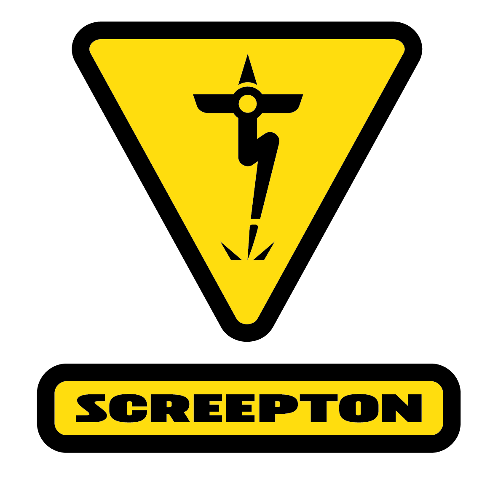

<!-- # Riton-Github <!-- First-level heading --> <!-- TO COMMENT --> 

<h1 align=center>Screepton</h1>

 > Screepton + CheatSheet of ReadMe layout + Github organization   <!-- to quote line -->

<p align=center>
  
   <!--  -->
</p>

<details><summary>3D Print Software Related</summary>  <!-- to collapsed menu, add open to detail to leave it open -->


<!--## Klipper-->
<h2 align=center>1. Klipper</h2>

<table align=center>
<tr>
 <td align=center>
  <p><h3><a href="https://github.com/Klipper3d/klipper">Klipper</a></h3></p>
  <a href="https://github.com/Klipper3d/klipper"> 
  
  </a>
 </td>

 <td align=center>
  <p><h3><a href="https://github.com/Frix-x/klippain target=_blank">Klippain</a> & <a href="https://github.com/elpopo-eng/klippain-chocolate" target="_blank">Klippain-🍫</a></h3></p>
  <a href="https://github.com/Frix-x/klippain"> 
  
  </a>
 </td>

<td align=center>
  <p> <h3> <a href=https://github.com/KalicoCrew/kalico target=_blanck>Kalico</a></h3></p>
  <a href=https://github.com/Frix-x/klippain> 
  
  </a>
 </td>
</tr>
</table>

<!--## Klipper Add-On Software-->
<h2 align=center>2.Klipper Add-On Software</h2>
<table align=center>
<tr>
 <td align=center>
  <p><h3><a href=https://github.com/dw-0/kiauh target=_blank>KIAUH</a></h3></p>
  <a href=https://github.com/dw-0/kiauh> 
  
  </a>
 </td>

 <td align=center>
  <p><h3><a href=https://github.com/Esoterical/voron_canbus target=_blank>Esoterical CAN Bus Guide</a></h3></p>
  <a href=https://github.com/dw-0/kiauh> 
  
  </a>
 </td>

 <td align=center>
  <p><h3><a href=https://github.com/fbeauKmi/update_klipper_and_mcus/tree/main target=_blank>UKAM</a></h3></p>
  <a href=https://github.com/fbeauKmi/update_klipper_and_mcus/tree/main> 
  
  </a>
 </td>
</tr>

<tr>
 <td align=center>
  <h3><a href=https://github.com/Frix-x/klippain-shaketune target=_blank>Shake & Tune</a></h3>
 </td>
 <td align=center> 
  <h3><a href=https://github.com/andrewmcgr/klipper_tmc_autotune target=_blank>TMC Autotune</a></h3>
 </td>
 <td align=center> 
  <h3><a href=https://github.com/viesturz/klipper-toolchanger target=_blank>Klipper ToolChanger</a></h3>
 </td>
</tr>
</table>

<!--## Slicer-->
<h2 align="center">3.Slicer</h2>

<table align=center>
<tr>
 <td align=center>
  <p><h3><a href=https://github.com/supermerill/SuperSlicer>SuperSlicer</a></h3></p>
  <a href=https://github.com/supermerill/SuperSlicer> 
  
  </a>
 </td>

 [OrcaSlicer](https://github.com/OrcaSlicer/OrcaSlicer)

[preFlight](https://github.com/oozebot/preFlight)

<!--## Tuning-->
<h2 align="center">Print Tuning</h2>

[Ellis Print Tuning Guide](https://github.com/AndrewEllis93/Print-Tuning-Guide)

<!--## Others-->
<h2 align="center">Others</h2>


[stlTexturizer](https://github.com/CNCKitchen/stlTexturizer)

</tr>
</table>

</details>

---

<details>  <!-- to collapsed menu, add open to detail to leave it open -->

<summary>3D Print HW Related</summary>

<!--## ToolChanger-->

<p align="center">
   <h2 align="center">ToolChanger [TC]</h2>
</p>

 [Draft Shift Design](https://github.com/DraftShift)

<!--## ToolHeads (TH) & Extruder-->

<p align="center">
   <h2 align="center">ToolHeads [TH] & Extruder</h2>
</p>

<!--## MMU-->

<p align="center">
   <h2 align="center">Multi Material Unit [MMU]</h2>
</p>

 [HappyHare](https://github.com/moggieuk/Happy-Hare)

 [Enraged Rabbit Collective](https://github.com/Carrot-collective)

 [BoxTurtle](https://github.com/ArmoredTurtle/BoxTurtle)

[Expandable Multi-color Unit](https://github.com/DW-Tas/EMU)

[QuattroBox](https://github.com/Batalhoti/QuattroBox)

 [TradRack](https://github.com/Annex-Engineering/TradRack)

[OpenAMS](https://openams.si-forge.com/)

<!--## Mods-->

<p align="center">
   <h2 align="center">Voron Mods</h2>
</p>

 [VoronUsers](https://github.com/VoronDesign/VoronUsers)

 [Monolith3D](https://github.com/Monolith3D)

[MiniBFI]

[Z Joint]

<!--## Filter-->

<p align="center">
   <h2 align="center">Filter</h2>
</p>

[Nevermore](https://github.com/nevermore3d)

[TheFilter](https://github.com/nateb16/VoronUsers/tree/master/printer_mods/nateb16/THE_FILTER)

</details>

---

<details>  <!-- to collapsed menu, add open to detail to leave it open -->

<summary>Basic formatting syntax</summary>

## Basic formatting syntax

**This is bold text**

_This text is italicized_

~~This was mistaken text~~

**This text is _extremely_important**

***All this text is important***

This is a <sub>subscript</sub> text

This is a <sup>superscript</sup> text

This is an <ins>underlined</ins> text

```bash
python code
```

```ruby
   puts "Hello World"
```

- [ ] Task 1
- [ ] Task 2 can be URL
- [X] Task DONE (+emoji :tada:) <!-- Emoji Cheat Sheet : https://gist.github.com/roachhd/1f029bd4b50b8a524f3c -->

</details>

---

<details>

<summary>Links & Images </summary>


## Links & Images

| Command | Description | |
| :---         |     :---:      |          ---: |
| Left side aligned | Centered | Right side |
| `git status` | List all *new or modified* files | |
| `git diff` | Show file differences that **haven't been** staged | |

---

Here is a Mermaid diagram :
(more info here [Mermaid site](http://mermaid.js.org/#/).


---

**The Cauchy-Schwarz Inequality**

```math
\left( \sum_{k=1}^n a_k b_k \right)^2 \leq \left( \sum_{k=1}^n a_k^2 \right) \left( \sum_{k=1}^n b_k^2 \right)
```

---

This site was built using [GitHub Pages](https://pages.github.com/).

---


</details>

---

> [!NOTE]
> Useful information that users should know, even when skimming content.

> [!TIP]
> Helpful advice for doing things better or more easily.

> [!IMPORTANT]
> Key information users need to know to achieve their goal.

> [!WARNING]
> Urgent info that needs immediate user attention to avoid problems.

> [!CAUTION]
> Advises about risks or negative outcomes of certain actions.
