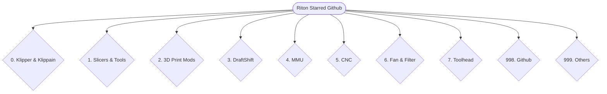

# Riton-Github <!-- First-level heading --> <!-- TO COMMENT -->
> CheatSheet of ReadMe layout + Github organization #to quote line


---

<details>  <!-- to collapsed menu, add open to detail to leave it open -->

<summary>3D Print Software Related</summary>

## Klipper

Klipper [Klipper GitHub](https://github.com/Klipper3d/klipper).

Klippain [Klippain GitHub](https://github.com/Frix-x/klippain).

Klippain Chocolate [Klippain-chocolate GitHub](https://github.com/elpopo-eng/klippain-chocolate).

Kalico [Kalico GitHub](https://github.com/KalicoCrew/kalico).

## Slicer & Tools

</details>

---

---

<details>  <!-- to collapsed menu, add open to detail to leave it open -->

<summary>3D Print HW Related</summary>

## ToolChanger

## ToolHeads (TH) & Extruder

## MMU

## Mods

## Filter

</details>

---

---

<details>  <!-- to collapsed menu, add open to detail to leave it open -->

<summary>Basic formatting syntax</summary>

## Basic formatting syntax

**This is bold text**

_This text is italicized_

~~This was mistaken text~~

**This text is _extremely_important**

***All this text is important***

This is a <sub>subscript</sub> text

This is a <sup>superscript</sup> text

This is an <ins>underlined</ins> text

```bash
python code
```

```ruby
   puts "Hello World"
```

- [ ] Task 1
- [ ] Task 2 can be URL
- [X] Task DONE (+emoji :tada:)

</details>

---

<details>

<summary>Links & Images </summary>


## Links & Images

| Command | Description | |
| :---         |     :---:      |          ---: |
| Left side aligned | Centered | Right side |
| `git status` | List all *new or modified* files | |
| `git diff` | Show file differences that **haven't been** staged | |

---

Here is a Mermaid diagram :
(more info here [Mermaid site](http://mermaid.js.org/#/).



---

**The Cauchy-Schwarz Inequality**

```math
\left( \sum_{k=1}^n a_k b_k \right)^2 \leq \left( \sum_{k=1}^n a_k^2 \right) \left( \sum_{k=1}^n b_k^2 \right)
```

---

This site was built using [GitHub Pages](https://pages.github.com/).

---


</details>

---

> [!NOTE]
> Useful information that users should know, even when skimming content.

> [!TIP]
> Helpful advice for doing things better or more easily.

> [!IMPORTANT]
> Key information users need to know to achieve their goal.

> [!WARNING]
> Urgent info that needs immediate user attention to avoid problems.

> [!CAUTION]
> Advises about risks or negative outcomes of certain actions.
